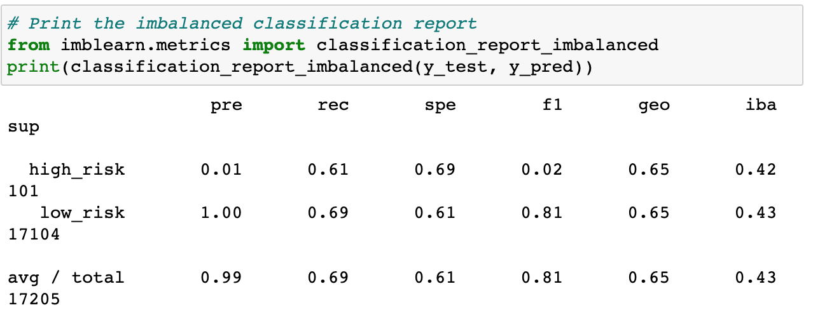

# Credit_Risk_Analysis

## Overview of the analysis
In this project. I applied machine learning to evaluate credit card risk. However, Credit card risk is unbalanced. Therefore, I used six different techniques to train and evaluate models using imbalanced-learn and scikit-learn libraries. 

I oversampled the data using the RandomOverSampler and SMOTE, undersampled the data using the ClusterCentroids aalgorithm. I then combined over and undersampling using the SMOTEENN algorithm. Then I compared these two to the BalancedRandomForestClassifier and EasyEnsembleClassifier. 

## Results: Comparing accuracy scores, precision, and recall of all three models. 

### RandomOverSampler

- Balanced accuracy score: .640. This means that the model is correct 64.0% of the time. 
      

- Precision: .99. This means that the algorithm is 99% reliable in prediciting positive classifications.

- Recall: .62. This means that of the positive outcomes, the algorithm correctly classified them as positive 62% of the time.
      

### SMOTE
- Balanced accuracy score: .651. This means that the model is correct 65.1% of the time. 
      

- Precision: .99. This means that the algorithm is 99% reliable in prediciting positive classifications. 

- Recall: .69. This means that of the positive outcomes, the algorithm correctly classified them as positive 69% of the time.
      

### ClusterCentroids
- Balanced accuracy score: .545. This means that the model is correct 54.5% of the time. 
      

- Precision: .99. This means that the algorithm is 99% reliable in prediciting positive classifications. 

- Recall: .40. This means that of the positive outcomes, the algorithm correctly classified them as positive 40% of the time.
      

### SMOTEENN 
- Balanced accuracy score: .645. This means that the model is correct 64.5% of the time. 
      

- Precision: .99. This means that the algorithm is 99% reliable in prediciting positive classifications. 

- Recall: .57. This means that of the positive outcomes, the algorithm correctly classified them as positive 57% of the time.
      

### BalancedRandomForestClassifier
- Balanced accuracy score: .789. This means that the model is correct 78.9% of the time. 
      

- Precision: .99. This means that the algorithm is 99% reliable in prediciting positive classifications. 

- Recall: .87. This means that of the positive outcomes, the algorithm correctly classified them as positive 87% of the time.
      

### EasyEnsembleClassifier
- Balanced accuracy score: .932. This means that the model is correct 93.2% of the time. 
      

- Precision: .99. This means that the algorithm is 99% reliable in prediciting positive classifications. 

- Recall: .94. This means that of the positive outcomes, the algorithm correctly classified them as positive 94% of the time.
      

## Summary and Recommendations
While the precision level was the same for all six machine learning models. The two models with the highest balanced accuracy scores and recall levels are the last two: Random Forest Classifier and Easy Ensemble Classifier. Ultimatley, I would recommend the Easy Ensemble Classifier because it had an Balanced Accuracy Score of 93.2% and a Recall of 94%, making it the most reliable algorithm for Credit Risk. 
